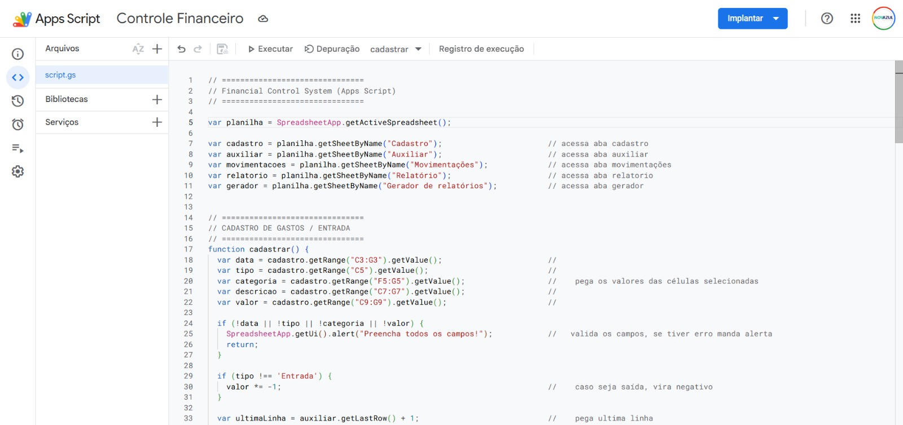
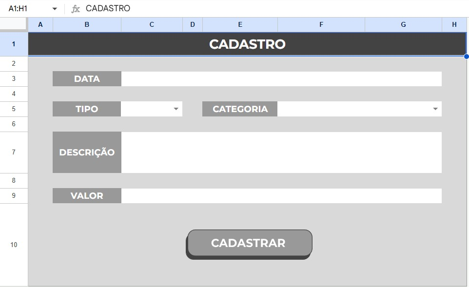
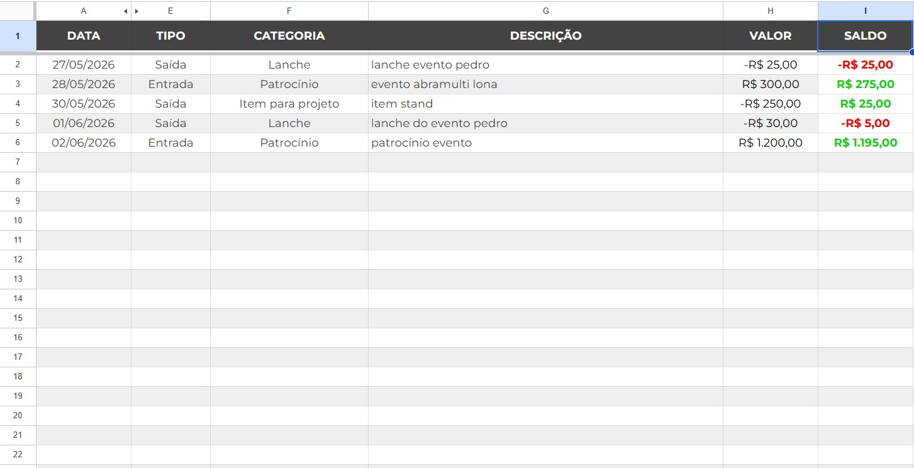
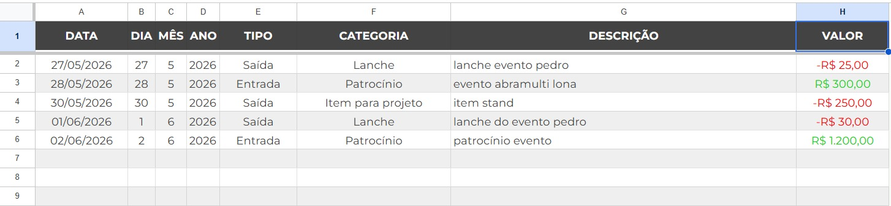
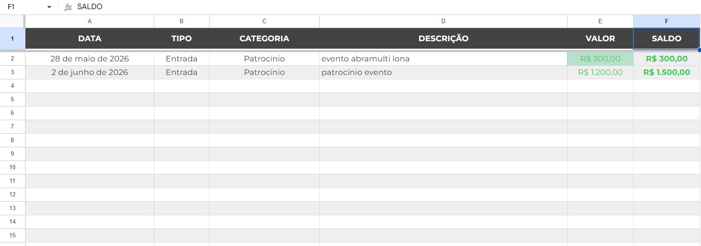
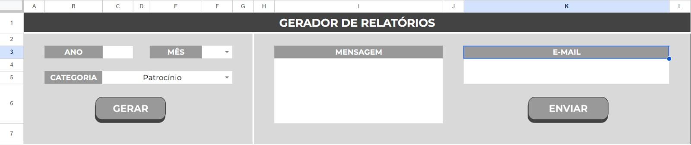

# 💰 Financial Control Automation

Este projeto foi desenvolvido com o objetivo de aprofundar meus conhecimentos em automação de planilhas utilizando Google Apps Script.

A ideia surgiu como um teste prático, pensando em uma aplicação real: controle de gastos em eventos, onde funcionários possam registrar despesas de forma organizada e centralizada.

---

## 🚀 Funcionalidades

- Cadastro de movimentações financeiras (entradas e saídas)
- Registro de:
  - Data
  - Tipo (entrada ou saída)
  - Categoria
  - Descrição
  - Valor
- Cálculo automático de saldo
- Geração de relatório financeiro
- Envio automático do relatório em PDF por e-mail
- Limpeza automática de campos após uso

---

## 🧠 Objetivo do Projeto

Este projeto foi criado como um simulador com foco em aprendizado, explorando o potencial do Google Apps Script para automatizar processos dentro do Google Sheets.

A proposta é evoluir essa estrutura para um cenário real, onde:

- Funcionários possam registrar gastos de eventos (ex: viagens, feiras, reuniões)
- Incluir comprovantes (como Pix)
- Centralizar todas as movimentações em uma base organizada
- Gerar relatórios automaticamente para controle interno da empresa

---

## 🛠 Tecnologias Utilizadas

- Google Sheets
- Google Apps Script (JavaScript)

---

## 📈 Aprendizados

Durante o desenvolvimento deste projeto, tive a oportunidade de aprofundar meus conhecimentos em:

- Automação de processos com Apps Script
- Manipulação de planilhas via código
- Estruturação de lógica para controle financeiro
- Criação de fluxos completos (entrada de dados → processamento → saída em relatório)

Além disso, no estágio venho explorando cada vez mais o potencial do Apps Script e entendendo como ele pode ser utilizado para resolver problemas reais dentro de empresas, indo muito além de simples planilhas.

---

## 🔮 Próximos Passos

- Filtro de relatórios por evento
- Dashboard com indicadores financeiros
- Integração com Google Forms para input dos funcionários
- Armazenamento de comprovantes de pagamento
- Estrutura mais robusta para uso em ambiente corporativo

---

## 📌 Observação

Este projeto foi desenvolvido com fins de estudo e aprendizado, mas já com visão de aplicação prática em ambientes reais.

---

## 👨‍💻 Autor

Desenvolvido por [Pedro Canuto]

## 📷 Preview

## 📷 Preview

### Cadastro

### Movimentações

### Auxiliar

### Relatório

### Gerador

